[toc]

# Ultra-Wideband Multipath Triangulate Localization Algorithm

## Motivation

Achieve a ultra-low-power single anchor localization for both target objects  and reflection objects by taking advantages of  multipath effects instead of eliminating them.

**Why it is novel?**

- **Low power Localization**

  Achieve a **ultra-low-power** UWB localization system 

  

  with **a single anchor** that **does not require a priori knowledge** **or profiling of the environment**.

- Low cost Localization

  

- **Unaided device localization** 

  A single receiver can localize a transmitting target **without coordinating with any other nodes**, requires no data sharing or even two-way communication between the transmitter and receiver.

- **Reflection objects Localization**

  Achieve the localization not only for the target object but also for reflection objects by utilizing the multipath effects and the geometric relationship between the reflection object and the target object.

- **Antenna orientation Localization**

  Be able to determine a relatively accurate estimation for the antenna orientation in the transmitter side.

Compare with state-of-the-art single anchor UWB localization system：

1.No need for a priori knowledge of the environment（can be main contribution）

2. Low power consumption (all tags only transmit and do not receive, but multiple antennas are required,
   It is mainly used for the estimation of AOD）

  -There is a trade off: whether the tag power consumption of multiple antenna will be lower 

3. The design of the anchor board（It can be based on ULoc's existing platform, and L-Shape does have certain benefits）

4. Easy to deploy and low deployment overhead

  But trade off in price：

-savings on a single anchor board at the anchor end

-increasing cost due to the number of antennas at the tag end 


**Compare with WIFI localization system****：**

\1. UWB has larger bandwidth

\2. More flexible

The single anchor localization of WIFI requires small-size objects to have a 3-element antenna array transmitter.

And the presence of tag makes positioning more flexible

\3. The L-shape anchor board provides a large aperture, and the asymmetrical antenna array avoids AOA and AOD ambiguity

## Workflow

At the receiver end, the single anchor will receive multiple propagation paths. We will select the fastest and strongest path as the Direct Path (LoS), and then choose a few relatively strong propagation paths as Reflection Paths. Then, establish a triangle between the direct path and one of these reflection paths, and obtain the CIR (Channel Impulse Response) of these Paths to calculate the AOA (Angle of Arrival) and AOD (Angle of Departure) . We will also obtain the relative TOF (Time of Flight) from CIR , therefore  obtaining the relative distance between the direct path and the reflection paths .

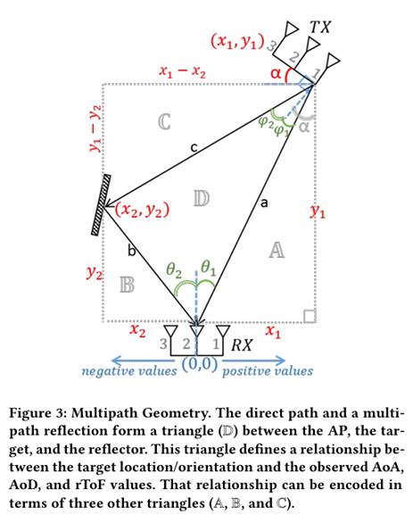

For each triangle formed by the Direct Path and Reflection Paths, use the AOA, AOD, and rTOF to perform localization, obtaining the target's location. We will then take the average of all these positions to get the final result.

We will use TDMA (Time Division Multiple Access) to perform positioning for multiple tags. For each tag, transmit multiple packets to improve the positioning accuracy.

1.Leveraging multiple propagation paths (Direct Path and Reflection Paths) to obtain AOA, AOD, and rTOF information.

2.Establishing triangles using these paths and using the geometric relationships to position the target.

3.Optimizing the positions obtained from multiple triangles to improve accuracy.

4.Utilizing TDMA to support multiple tags, and transmitting multiple packets per tag to enhance precision.

## Implementation

A UWB multipath triangulate localization algorithm is proposed and achieved. The code also includes the generation of UWB signal and a self-defined simple channel model, the extract of CIR, the obtainment of AOA, AOD, rTOF and the achievement of the localization algorithm. The simulation is initially verified successfully.

### Generate UWB signals compliant with IEEE 802.15.4a Standard

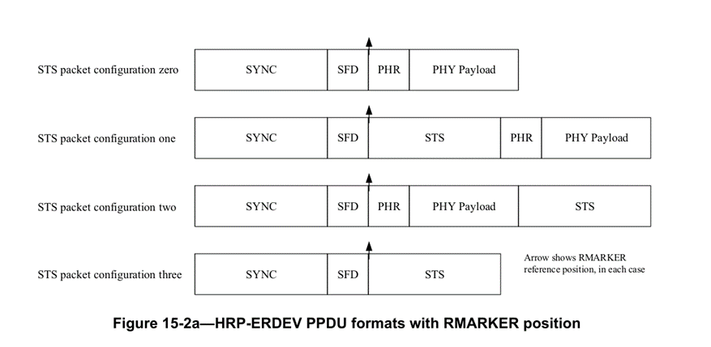

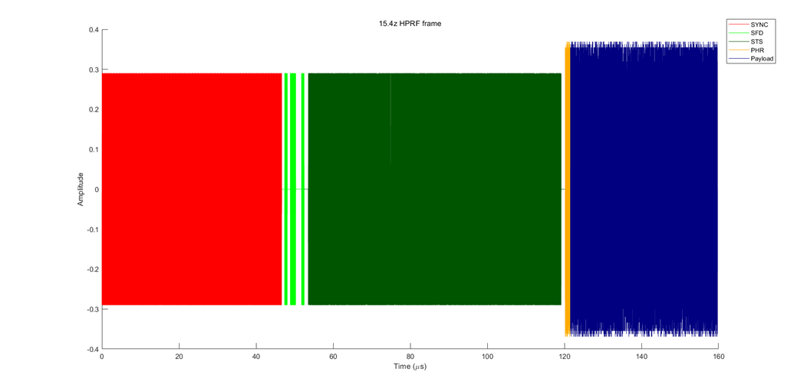

```matlab
cfg4a = 
  lrwpanHRPConfig - 属性:

             Channel: 3
                Mode: '802.15.4a'
             MeanPRF: 15.6000
            DataRate: 0.8500
     SamplesPerPulse: 4
           CodeIndex: 6
     PreambleMeanPRF: 16.1000
    PreambleDuration: 64
             Ranging: 0
          PSDULength: 100

   Read-only properties:
          SampleRate: 1.9968e+09
```

### **Establish a transmission channel model**

#### Why didn't I use the UWN Channel Model in MATLAB and why did I establish a transmission channel model myself?

There are two reasons why I don't use the UWB Channel Model in MATLAB directly 

- I found that the model doesn't introduce the time delay , which means the CIR is not that accurate.
- The model doesn't have much flexibility and freedom.

#### Link Model Based on Free-Space Path Loss

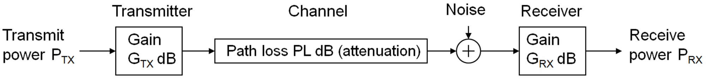

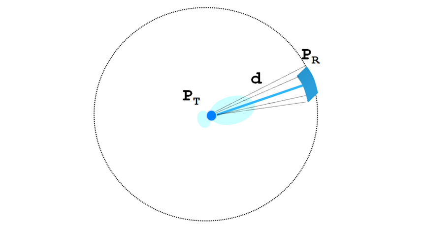

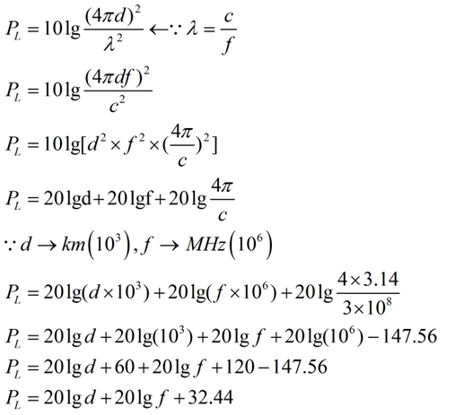

#### Channel Model

1.Application of free space path loss(FSPL) as the model of multipath fading

```matlab
direct_path_loss_dB = 20*log10(direct_path_distance) +20*log10(4992.8e6) - 147.55; % dB
reflection1_loss_dB = 20*log10(reflection1_distance) +20*log10(4992.8e6)- 147.55; % dB
reflection2_loss_dB = 20*log10(reflection2_distance) +20*log10(4992.8e6)- 147.55; % dB
```

2.TX/RX antenna gain

3.Manually add time delay for the direct path and multipaths

```matlab
 % calculate the time delay for each path
        direct_path_delay = direct_path_distance / speed_of_light; % 直射路径时延（秒）
        reflection1_delay = reflection1_distance / speed_of_light; % 反射路径1时延（秒）
        reflection2_delay = reflection2_distance / speed_of_light; % 反射路径2时延（秒）
        
        %Obtain the time-delayed signal for each path
        received_signal_direct_delayed = [zeros(round(direct_path_delay * fs),1) ;received_signal_direct_phase];
        received_signal_reflection1_delayed = [zeros(round(reflection1_delay * fs),1) ;received_signal_reflection1_phase];
        received_signal_reflection2_delayed = [zeros(round(reflection2_delay * fs),1); received_signal_reflection2_phase];
```

4.Manually add  phase delay for the direct path and multipaths

```matlab
        % Calculate the phase shift for each path
        direct_path_phase_shift = exp(-1j * 2 * pi * direct_path_distance / lambda);
        reflection1_phase_shift = exp(-1j * 2 * pi * reflection1_distance / lambda);
        reflection2_phase_shift = exp(-1j * 2 * pi * reflection2_distance / lambda);
        
        % Apply phase shifts to received signals
        received_signal_direct_phase = received_signal_direct .* direct_path_phase_shift;
        received_signal_reflection1_phase = received_signal_reflection1 .* reflection1_phase_shift;
        received_signal_reflection2_phase = received_signal_reflection2 .* reflection2_phase_shift;
```

5.Additive White Gaussian Noise(AGWN)

```matlab
% ADD AGWN
        noise_power = -80;
        noise = awgn(zeros(size(received_signal_total)), noise_power, 'measured'); 
```

### Experimental Scenario

We can conduct the basic configuration for the experimental scenario, including the locations of the target objects and the reflection objects, the gain of the antennas, the length and the angle of the antenna array.

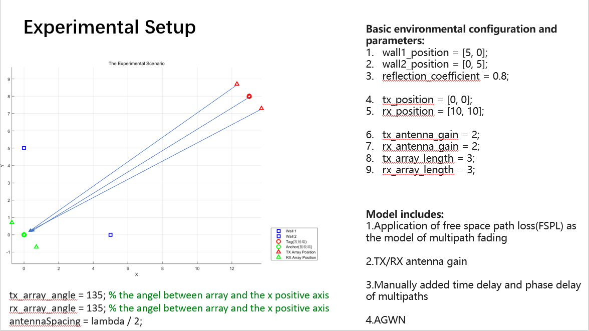

### **Extract CIR information**

#### The Verification for the Algorithm to Extract CIR

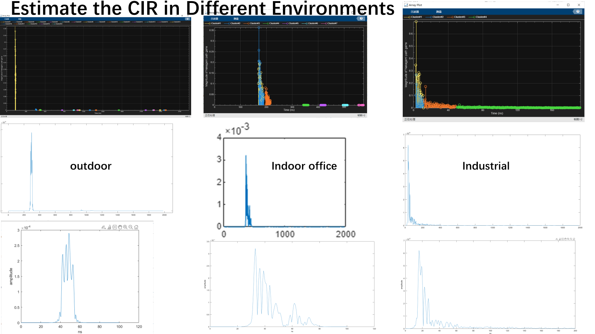

I first passed  the  UWB signal through Channel Model in MATLAB as a verification for CIR algorithm though its time delay is wrong but the waveform can be referred as ground truth. 

Seen from the waveform, it behaves well. And extracted CIR proves correct after many trials.

####  Analysis and Evaluation for AOD Obtained from CIR

**The key difficulty lies in the obtainment of Angle of Departure(AOD).**

I traverse the positions of tags, 64 experiments in total.

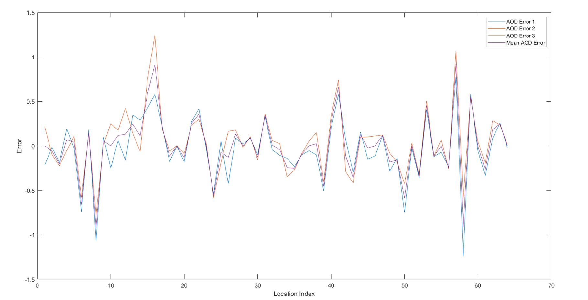

**We can see that almost all AOD errors are less than 1° in simulation.** 

#### Get Relatively Accurate TOF, AOA and AOD Obtained from CIR for Direct Path and Multipaths

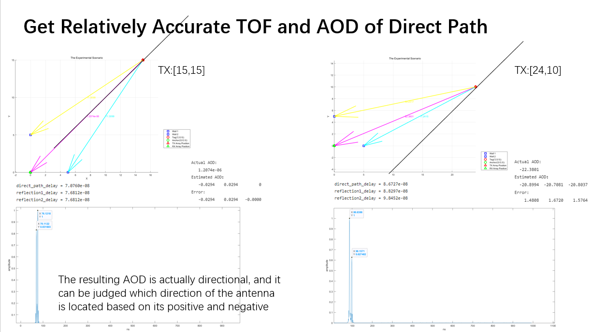

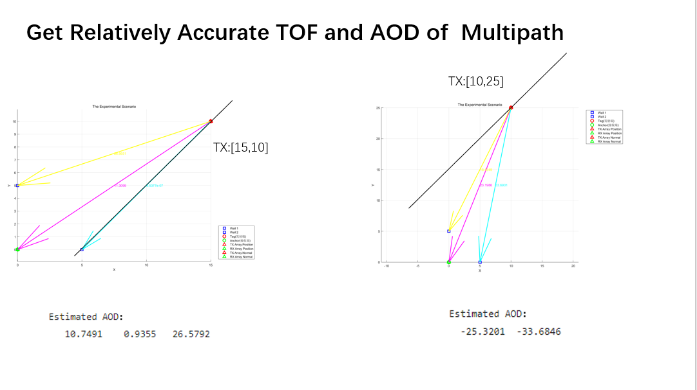

**We can see that obtained TOF and AOD are both near the ground truth.**

### **Localization Algorithm**

**1.Conduct a coarse-grained search** 

```matlab
function x0 = findLocalization(theta1, theta2, phi1, phi2, rTOF)
    theta1 = deg2rad(theta1);
    theta2 = deg2rad(theta2);
    phi1 = deg2rad(phi1);
    phi2 = deg2rad(phi2);

    % 定义网格大小和范围
    gridRange = 20;
    gridSize = 0.5;

    % 生成网格点坐标
    [x1, y1, x2, y2] = ndgrid(-gridRange:gridSize:gridRange, -gridRange:gridSize:gridRange, -gridRange:gridSize:gridRange, -gridRange:gridSize:gridRange);
    x0 = [x1(:), y1(:), x2(:), y2(:)];

    % 计算目标函数值
    objectiveValues = objectiveFunction(x0, theta1, theta2, phi1, phi2, rTOF);

    % 找到最小值
    [~, idx] = min(objectiveValues);
    x0 = x0(idx, :);
end

function fval = objectiveFunction(x, theta1, theta2, phi1, phi2, rTOF)
    x1 = x(:, 1);
    y1 = x(:, 2);
    x2 = x(:, 3);
    y2 = x(:, 4);

    % 计算目标函数值
    fval = (tan(theta1) - x1./y1).^2 + (tan(theta2) - x2./y2).^2 + (tan(phi1 + theta1 - phi2) - (x1 - x2)./(y1 - y2)).^2 + ((rTOF * physconst('Lightspeed') * 1e-9) - (-sqrt(x1.^2 + y1.^2) + sqrt(x2.^2 + y2.^2) + sqrt((x1 - x2).^2 + (y1 - y2).^2))).^2;
end
```

**2.Iterate the search parameters to conduct a fine-grained search**

```matlab
function xOpt = optimizeLocalization(x0, theta, phi, rTOF)
    % 转换角度为弧度
    theta = deg2rad(theta);
    phi = deg2rad(phi);
    reflection_number = length(theta);

    % 迭代搜索参数
    searchParams = {
        % struct('range', 5, 'step', 1),   % 初始粗搜索范围和步长
        struct('range', 1, 'step', 0.03), % 中等搜索范围和步长
        % struct('range', 0.1, 'step', 0.01) % 细化搜索范围和步长
    };

    % 逐级迭代搜索
    for i = 1:length(searchParams)
        param = searchParams{i};
        fineRange = param.range;
        fineStep = param.step;

        % 动态生成精细的网格点坐标
        fineGridCell = cell(1, 2 * reflection_number);
        for j = 1:2*reflection_number
            fineGridCell{j} = (x0(j)-fineRange):fineStep:(x0(j)+fineRange);
        end
        [fineGridCell{:}] = ndgrid(fineGridCell{:});
        fineGrid = cell2mat(cellfun(@(x) x(:), fineGridCell, 'UniformOutput', false));

        % 计算目标函数值
        fineObjectiveValues = objectiveFunction(fineGrid, theta, phi, rTOF);

        % 找到最小值
        [~, fineIdx] = min(fineObjectiveValues);
        x0 = fineGrid(fineIdx, :);
        display(x0);
    end

    xOpt = x0;
end
```

Note: The granularity of the first search is important, otherwise it may skip the global optimal and fall into the local optimum

## Localization Results

### Achieve the centimeter-level accuracy for some cases

For some cases, it can achieve the centimeter-level accuracy.


###  Estimated Results and Error Analysis

Here , take two experimental scenarios randomly as an example to show the estimated results and the error analysis.

#### Experimental Scenario 1:

**Wall 1: [0,5]**

**Wall 2: [5,0]**

**TagOrientation**= 60

**SamplesPerPulse**=16

CDF of Error Sequence for the Target Object

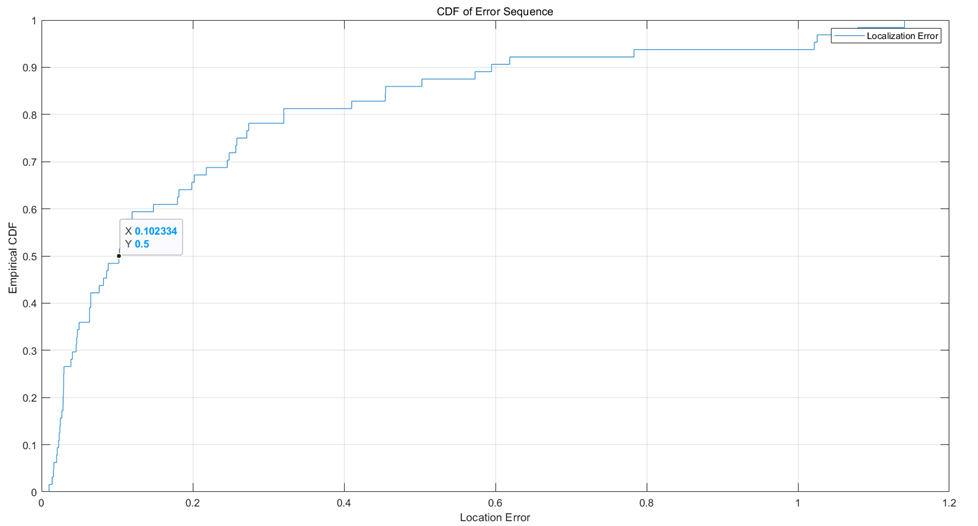

Estimation of Reflection Objects

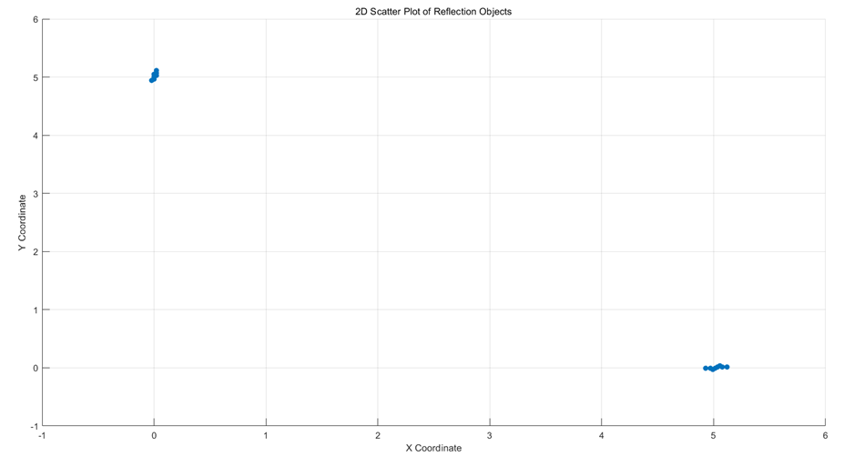

#### Experimental Scenario 2

**Wall 1: [1,5]**

**Wall 2: [3,0]**

**TagOrientation= 60**

**SamplesPerPulse=16**

CDF of Error Sequence for the Target Object

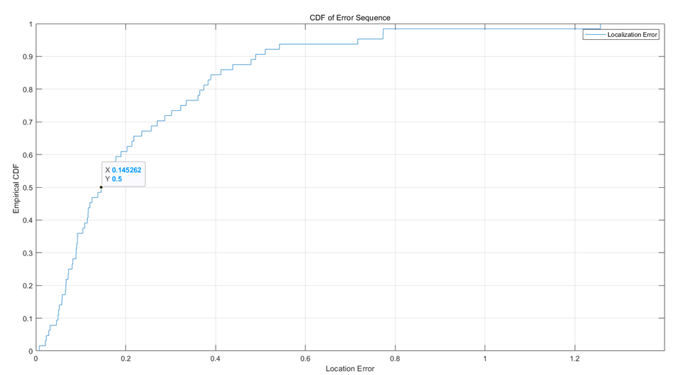

Estimation of Reflection Objects


## Reference

[1]Z. Chen *et al*., "M3M3: Multipath Assisted Wi-Fi Localization with a Single Access Point," in *IEEE Transactions on Mobile Computing*, vol. 20, no. 2, pp. 588-602, 1 Feb. 2021, doi: 10.1109/TMC.2019.2950315. keywords: {Wireless fidelity;Receivers;Channel estimation;Transmitters;Signal resolution;Antenna arrays;Wi-Fi localization;multipath;MIMO;multi-channel;channel estimation},

[2]Elahe Soltanaghaei, Avinash Kalyanaraman, and Kamin Whitehouse. 2018. Multipath Triangulation: Decimeter-level WiFi Localization and Orientation with a Single Unaided Receiver. In Proceedings of the 16th Annual International Conference on Mobile Systems, Applications, and Services (MobiSys '18). Association for Computing Machinery, New York, NY, USA, 376–388. https://doi.org/10.1145/3210240.3210347

[3]F. Ge and Y. Shen, "Single-Anchor Ultra-Wideband Localization System Using Wrapped PDoA," in *IEEE Transactions on Mobile Computing*, vol. 21, no. 12, pp. 4609-4623, 1 Dec. 2022, doi: 10.1109/TMC.2021.3083613. keywords: {Location awareness;Antenna measurements;Estimation;Three-dimensional displays;Mobile computing;Ultra wideband antennas;Position measurement;3D single-anchor localization;UWB antenna array;phase ambiguity;soft positional information;information fusion},
